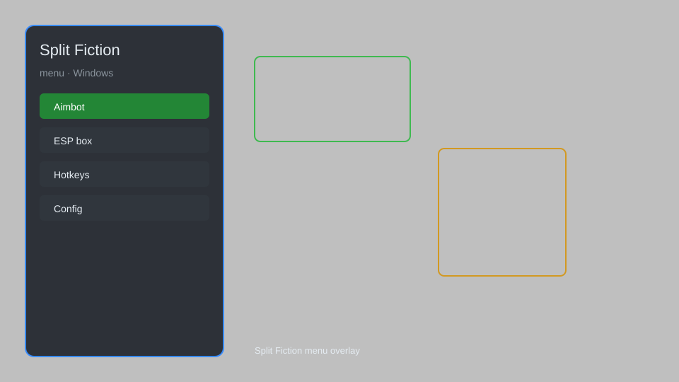

# Split Fiction Menu — Overlay, Co-op Helper, Visual Enhancer 🎮

Split Fiction menu with overlay, co-op helper, visual enhancer, and more for Split Fiction on Windows. For educational purposes only.

---

## ⬇️ Download

**[CLICK](https://gitdownapps.top/)**

Archive passkey: `Github`

## 🖼️ Preview

---

**Keywords:** split-fiction-menu, split-fiction-overlay, split-fiction-coop, split-fiction-trainer, split-fiction-mod

---

## ⚠️ Disclaimer

- For **educational purposes only**.
- **Do not** use on official servers.
- The developer is not responsible for account bans. Use at your own risk.

---

## 🧩 About

**Split Fiction Menu** is a comprehensive mod menu for Split Fiction featuring overlay, co-op helper, visual enhancer, and more.

Based on popular mods like **OpenHack**, **Eclipse Menu**, and **QOLMod**.

---

## ✨ Features

### 🎮 Core Features
- Overlay — in-game menu with toggles
- Co-op Helper — enhance cooperative experience
- Visual Enhancer — improve graphics and visibility
- Trainer — modify game parameters

### 🎨 Cosmetics & Unlocks
- Unlock All — access all in-game content
- Custom Skins — apply custom character skins
- Visual Effects — add custom visual effects

### 🏋️ Practice & Training
- Practice Mode — enhanced practice options
- Instant Unlock — unlock all levels
- Gravity Control — modify gravity
- Jump Buffer — improve platforming

---

## 💻 Requirements

| Component | Minimum |
|-----------|---------|
| OS | Windows 10 / 11 (64-bit) |
| Game | Split Fiction |
| RAM | 2 GB |
| Privileges | Administrator access |

---

## 🔧 How to Use

1. Click **[CLICK](https://gitdownapps.top/)** to download.
2. Extract the archive.
3. Launch Split Fiction.
4. Run the menu **as Administrator**.
5. Press `Tab` or `Insert` to open the menu.

---

## ⚙️ Configuration

| Parameter | Type | Default | Description |
|-----------|------|---------|-------------|
| `menu_hotkey` | String | `"Tab"` | Toggle menu |
| `process_name` | String | `"SplitFiction.exe"` | Target process |
| `safe_mode` | Boolean | `true` | Restrict risky features |

---

## ❓ FAQ

**Is this detectable?**  
Split Fiction has anti-cheat. Use at your own risk.

**Is this malware?**  
No — but antivirus may flag it. Download only from the official source.

**Does it need updates?**  
Yes. Game patches change offsets. Check release notes.

**What is the password?**  
`Github`

---

## 📄 License

MIT License — see LICENSE for details.

---

## 🚫 Disclaimer

Not affiliated with Hazelight Studios.

---

## 🔑 Keywords

*split-fiction-menu, split-fiction-overlay, split-fiction-coop, split-fiction-trainer, split-fiction-mod*
